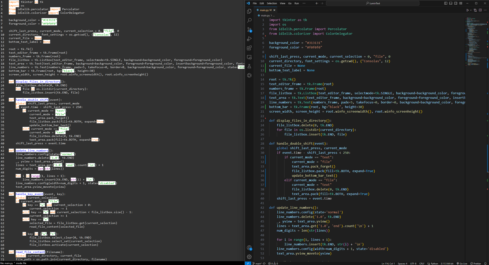

# LuminText

LuminText is a simple and intuitive text editor built using Python's tkinter library. It provides a user-friendly interface for creating and editing text files, along with basic file management functionalities. With its minimalist design and essential features, LuminText offers a hassle-free experience for users to write and edit text conveniently.

Image of an early version compared to VSCode.

## Features

- Clean user interface
- Basic text editing functionalities (such as creating, opening, and saving text files)
- Easily navigate and edit text files

## Requirements

- Python 3.x
- tkinter library (usually included in standard Python distributions)

## Usage

- Upon running the application, you can start writing and editing text in the main text editor area.
- Use the `Shift` (double press) key to switch between the text editor and file explorer modes.
- Navigate through the file explorer using the `W` and `S` keys and open files using the `E` key.

## Other

Feel free to contribute to the project by submitting bug reports, feature requests, or pull requests.
